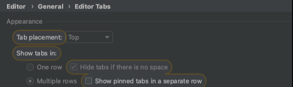

## > tab設定
  

- auto import number 上限設定 ( 在java那裡)
- auto import 設定
    - control + option + O

## > 好用套件

- sonar 檢查
- restful tool : 尋找url
    - cmd + \
- git toolbox
    - 可以看每一行誰編輯過
- 阿里巴巴檢查
- Jrebel

## > debug相關技巧

- 射中斷點
- 隨意執行程式

## > 好用快捷鍵

- optimize import: Control + Option + O:
- action: rename, try catch
- 自動宣告 local variable
    - option + enter
- 找used: cmd + B

## > git相關

- git selection的方式查找
- commit and push 這個可以把東西rebase and push
- shelf

## > 版面快捷鍵

cmd + 1: 檔案

cmd + 0: git的變動

cmd + e: 看速查看之前大開過的file

cmd + shift + e: 快速查看之前改過的位置

## > 各式找尋快捷鍵

找class: CMD + O

找file: CMD + SHIFT + O

找action: CMD + SHIFT + A

找symbol: CMND +OPTION + O

Vim:

- gp: 找錯誤
